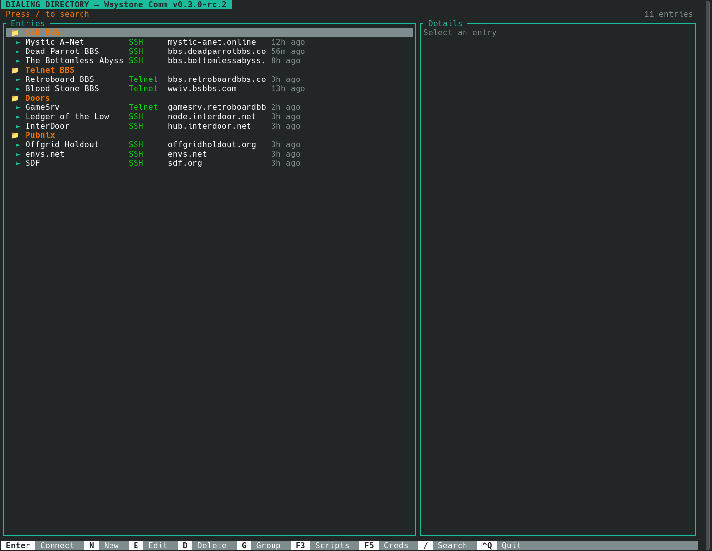

# Waystone Comm

Waystone Comm is a keyboard-driven communications terminal for Linux, inspired by
ProComm Plus and focused on real BBS and remote terminal use.

Current release candidate: **v0.3.0-rc.2**.



Waystone Comm currently supports SSH, Telnet, Serial, and Raw TCP sessions; tabbed
terminal use; ANSI/xterm and CP437 ANSI-BBS rendering; dialing-directory
entries; encrypted credentials; Rhai scripts; session logs; history; key
bindings; and X/Y/Zmodem transfer code with live Zmodem upload and download
validation.

This is still pre-1.0 software. The current RC is intended for source/tarball
testing and live BBS soak testing, not broad packaged distribution.

## Current Status

Verified in this RC:

- SSH v2 connections with password auth, filesystem private keys, and
  credential-backed Ed25519 keys.
- Legacy SSH compatibility mode for older BBS SSH daemons.
- Telnet with common RFC 854 option negotiation, including ECHO,
  SUPPRESS-GO-AHEAD, TERMINAL-TYPE, and NAWS.
- Serial connections with configurable baud rate, parity, data bits, stop bits,
  and flow control.
- Raw TCP connections.
- xterm-style ANSI rendering and `ansi-bbs` CP437 rendering for BBS art.
- ANSI-BBS 80-column canvas behavior for wide local terminals.
- Tabbed TUI sessions.
- Dialing directory with groups, search, edit/create/delete, emulation choice,
  credential assignment, and legacy SSH setting.
- Encrypted credential store for password, token, and SSH key credentials.
- Rhai scripts with `on_connect` and `on_data` hooks, entry scripts, in-app
  script editing, validation before save, login template support, and script
  runtime status.
- Session logging, history, and log viewer filters.
- Key mapping profiles and F-key bar labels.
- Raw capture replay for terminal-rendering debugging.
- Zmodem receive auto-detection.
- Zmodem upload/send from the TUI with `F6` or `Alt+U`.

Live validation so far includes Mystic A-Net over SSH, Dead Parrot BBS over SSH,
Retroboard over Telnet, GameSrv/LoRD ANSI-BBS rendering, and The Bottomless
Abyss SSH BBS upload testing.

Not included in this RC:

- Native packages such as `.deb`, AppImage, Homebrew, or Flatpak.
- GUI wrapper.
- Native Gemini, Gopher, Spartan, or web browsing. Those protocols belong in
  Waystone Browser.
- IRC, NNTP, Mosh, SFTP browser, or FTP UI.
- AI features.
- Python scripting.

## Roadmap

Waystone Comm is currently in the `v0.3.0-rc.2` beta cycle. The immediate goal is
stability, BBS compatibility, transfer reliability, and workflow polish before
cutting `v0.3.0`.

Planned future work:

- `v0.3.x`: bug fixes from beta feedback, BBS compatibility hardening, transfer
  reliability, and documentation cleanup.
- `v0.4.x`: packaging work such as `.deb` and AppImage, install/update
  documentation, and cleaner release automation.
- `v0.5.x`: broader protocol polish and possible expansion beyond the current
  SSH/Telnet/Serial/Raw TCP core where it strengthens terminal communication.
- Future Waystone Browser integration: hand off `gemini://`, `gopher://`,
  `spartan://`, `http://`, and `https://` links to Waystone Browser instead of
  duplicating browser features in Waystone Comm.
- Later releases: optional GUI wrapper, plugin/theming support, and other
  larger features after the terminal core is stable.

Gemini, Gopher, Spartan, and web browsing are intentionally out of scope for
Waystone Comm because they are native Waystone Browser responsibilities. IRC,
NNTP, Mosh, SFTP browser, AI assistance, and larger UI expansions remain
later-stage ideas.

## Install

### Prerequisites

On Debian or Ubuntu:

```bash
sudo apt-get install -y libssl-dev pkg-config libdbus-1-dev libudev-dev
```

Waystone Comm requires Rust 1.85 or newer.

### Build From Source

```bash
git clone https://github.com/njb1966/waystone-comm
cd waystone-comm
cargo build --release
```

The binary is:

```bash
target/release/waystone-comm
```

### Release Tarball

The `v0.3.0-rc.2` prerelease provides a Linux x86_64 tarball:

```text
waystone-comm-v0.3.0-rc.2-linux-x86_64.tar.gz
```

Verify it with the matching `.sha256` file from the GitHub release page.

## Usage

Launch the TUI:

```bash
waystone-comm
```

Connect directly from the CLI:

```bash
waystone-comm connect ssh user@example.org
waystone-comm connect ssh user@example.org --port 2222
waystone-comm connect ssh user@example.org --identity ~/.ssh/id_ed25519
waystone-comm connect ssh mystic-anet.online --legacy-ssh --ask-password --emulation ansi-bbs

waystone-comm connect telnet bbs.example.org:23 --emulation ansi-bbs
waystone-comm connect serial /dev/ttyUSB0 --baud 9600
waystone-comm connect raw example.org:4242
```

Replay a raw capture:

```bash
waystone-comm replay /tmp/waystone-comm.raw --emulation ansi-bbs
```

List saved directory entries:

```bash
waystone-comm list
```

## Terminal Emulation

New Telnet and raw TCP entries use `ansi-bbs` by default, because most classic
BBSes send CP437 art. New SSH and serial entries use `xterm-256color` by default.
You can change the mode with the `--emulation` option, or with the Left and Right
arrow keys on the Emulation field when you create or edit a directory entry.

`ansi-bbs` translates IBM CP437 high bytes into Unicode line and block glyphs
while preserving ANSI cursor movement and color handling. It also caps the BBS
drawing canvas at 80 columns so wide local terminals do not break ANSI art
layouts.

Use `xterm-256color` for UTF-8 systems. Dead Parrot BBS is one known case where
`xterm-256color` is the better choice, because the system emits UTF-8 block and
box drawing characters.

For old SSH BBS servers, add `--legacy-ssh`.

## Dialing Directory

The startup screen is the dialing directory.

Common keys:

| Key | Action |
|-----|--------|
| `Enter` | Connect to selected entry |
| `N` | New entry |
| `E` | Edit selected entry |
| `D` | Delete selected entry |
| `G` | Assign selected entry to a group |
| `F2` | Open dialing directory |
| `F3` | Open scripts |
| `F5` | Open credentials |
| `F8` | Open log viewer |
| `F9` | Open key mapping editor |
| `Esc` | Return to active session |

For a classic BBS entry, set emulation to `ansi-bbs`. For older SSH BBS daemons,
set `Legacy SSH` to `yes`.

While editing an entry, press `F5` to pick a credential and fill the Credential
UUID field without manual copy/paste.

## Credentials

The credential manager stores credentials in an encrypted SQLite database under
the Waystone Comm config directory.

Supported credential kinds:

- Password credentials, with optional username.
- Token credentials, available to scripts.
- SSH key credentials, generated as Ed25519 private keys with viewable public
  keys.

Password credentials can be used for SSH password and keyboard-interactive auth.
SSH key credentials can be attached to directory entries for public-key auth.

For BBS door-server scripts, a password credential exposes these script keys:

- `username`
- `password`
- `secret`

Script log output redacts attached password, token, and private-key values before
writing to the session log.

## Scripts

Waystone Comm uses Rhai scripts. Entry scripts live under:

```text
~/.config/waystone-comm/scripts/entries/
```

Named scripts live under:

```text
~/.config/waystone-comm/scripts/
```

Entry scripts run automatically when the matching dialing-directory entry
connects.

Minimal login example:

```rhai
fn on_connect(s) {
    if s.wait_for("What is your Alias:", 10.0) {
        s.send(s.credential("username") + "\r\n");
    }

    if s.wait_for("What is your Password:", 10.0) {
        s.send(s.credential("password") + "\r\n");
    }
}
```

Useful script API calls:

- `s.entry_name()`
- `s.log(message)`
- `s.send(text)`
- `s.wait_for(text, timeout_seconds)`
- `s.credential(key)`
- `s.disconnect()`

Keep `on_data` hooks short. They run when session data arrives.

## File Transfers

Waystone Comm supports Zmodem receive auto-detection and TUI-initiated upload/send.
Xmodem and Ymodem transfer code is present and covered by tests, but the
currently validated live workflow is Zmodem.

Downloads are saved to the desktop Downloads directory when available, otherwise
to the home directory. Remote DOS or Unix paths in transfer metadata are reduced
to the basename before saving.

To upload with Zmodem:

1. Start an upload on the BBS.
2. Choose the BBS Zmodem receive protocol.
3. Wait until the BBS is ready for the sender.
4. Press `F6` or `Alt+U`.
5. Enter the local file path.
6. Press `Enter`.

If a transfer fails, run with transfer tracing:

```bash
WAYSTONE_COMM_TRANSFER_DEBUG=/tmp/waystone-comm-zmodem.trace waystone-comm
```

## Logs And History

Waystone Comm stores session logs and history under the config directory. The log
viewer is available with `F8` and supports session, script, and transfer filters.

Raw byte capture for rendering debugging is available from the CLI:

```bash
waystone-comm connect ssh bbs.example.org --emulation ansi-bbs --raw-capture /tmp/waystone-comm.raw
waystone-comm replay /tmp/waystone-comm.raw --emulation ansi-bbs
```

## Key Bindings

Default session keys:

| Key | Action |
|-----|--------|
| `F2` | Dialing directory |
| `F3` | Script viewer |
| `F5` | Credential manager |
| `F6` | Send file |
| `Alt+U` | Send file fallback |
| `F7` | Receive file |
| `F8` | Log viewer |
| `F9` | Key mapping editor |
| `Ctrl+T` | New tab |
| `Ctrl+W` | Close tab |
| `Alt+1` through `Alt+9` | Switch tabs |
| `Ctrl+Q` | Quit |

Custom key profiles are stored under:

```text
~/.config/waystone-comm/keys/
```

## Configuration Files

Waystone Comm uses:

```text
~/.config/waystone-comm/
```

Common files and directories:

| Path | Purpose |
|------|---------|
| `directory.toml` | Dialing directory entries |
| `known_hosts` | Host-bound SSH fingerprints |
| `credentials.db` | Encrypted credential store |
| `machine.key` | Local key material for credential encryption |
| `history.db` | Session history |
| `logs/` | Session logs |
| `keys/` | Key mapping profiles |
| `scripts/` | Named scripts |
| `scripts/entries/` | Entry scripts |

## Development

Local release gates:

```bash
cargo fmt --check
cargo test --workspace
cargo clippy --workspace -- -D warnings
bash scripts/smoke-local.sh
cargo build --release
```

Live/manual release checks are documented in:

```text
SMOKE.md
PRODUCTION_SMOKE_CHECKLIST.md
```

Project structure:

```text
crates/
  waystone-comm-core/   Protocols, terminal emulator, credentials, logging, history,
                   scripts, key mappings, and transfer code.
  waystone-comm-tui/    CLI entry point, Ratatui app loop, panels, and TUI widgets.
```

## License

MIT. See [LICENSE](LICENSE).
